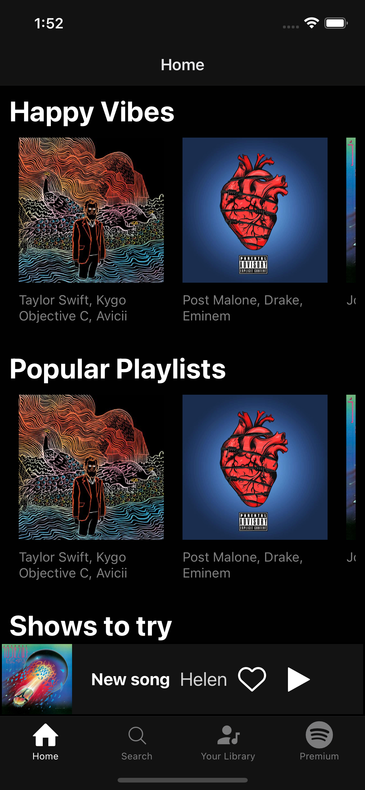
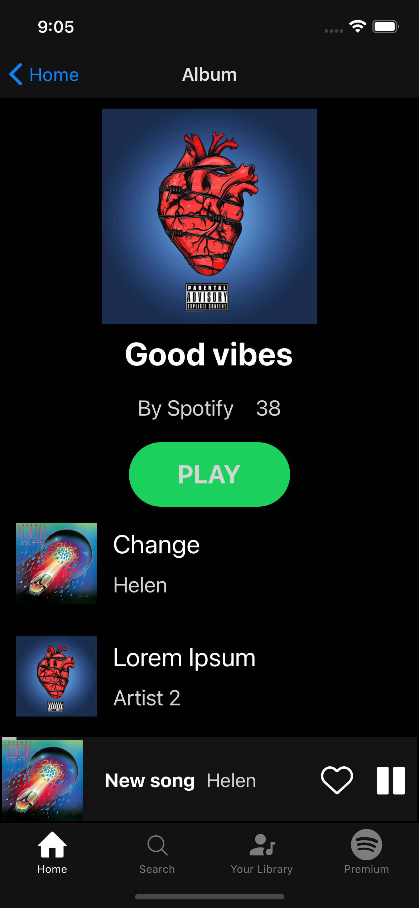

# Spotify for Mobile

React Native Spotify Application with TypeScript, GraphQL & AWS Services(Amplify)

# Complete Backend Recreating Spotify's API

# Live Demo on Expo

Unavailable

Spotify application for Android and iOS allows listener to find new music
and discover new artists

This project uses the following technologies:

- [React Native](https://reactnative.dev/) and [TypeScript](https://www.typescriptlang.org/) for frontend
- [Expo](https://expo.io/) and [Node.js](https://nodejs.org/en/) as the package manager
- [GraphQL](https://graphql.org/) Creates an easy to use graphical interface for querying our API.
- [Amplify](https://solidity.readthedocs.io/en/v0.7.0/) Convenient CLI for creating and uploading databases to the AWS Cloud.
- [Amazon Web Services](https://metamask.io/) Maintains the backend data for this project.

## Configuration

Please ensure you have all the above dependencies installed on your system including [Expo CLI](https://nodejs.org/en/), [Xcode(iOs)](https://nodejs.org/en/), [Android Studio](https://nodejs.org/en/) [Node.js](https://nodejs.org/en/)

-[Clone]https://github.com/derekwebdevcom/SpotifyReactNative.git for Mac or -[Download Zip](https://github.com/derekwebdevcom/SpotifyReactNative/archive/refs/heads/main.zip) for Windows

## Quick Start:

// Yarn install and Yarn start. Client Application ports on
http://localhost:19002/ Run on iOs simulator or Android Device
(must have mobile environments set up)
